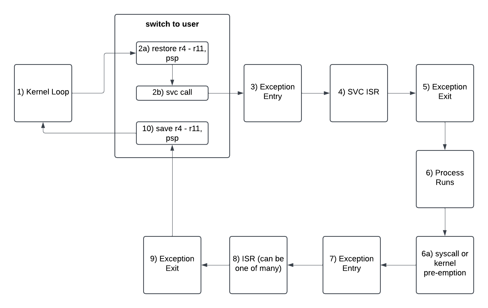

# Tock Control Flow, Interrupts & Invariants

## ARM 

### Control Flow 

The control flow for cortex-m (`v6m` and `v7m`) is as follows. 

_Note: The links below are to the v6m code but the v7m code is similar_

1. We start in the kernel loop where the scheduler will decide what process to run.
2. If we decide to run a process, we will execute the [`switch_to_user` assembly](https://github.com/tock/tock/blob/a1966b8ddaa1ce819b80f2f7bea466eb76e5b46c/arch/cortex-m0/src/lib.rs#L374), which has 3 distinct components - however, only the first two are executed sequentially. 
    1. Restore registers `r4 - r11`, along with the `process stack pointer` from the [stored state struct for the process](https://github.com/tock/tock/blob/50f36b3ccba7d8187e4c005da18999bab5235be1/arch/cortex-m/src/syscall.rs#L49). 
    2. Make an `svc` call to branch to the process.
3. `svc` will trigger an exception, which will cause the hardware to handle some logic for us (referred to as exception entry). 
    1. The hardware will determine what stack to use (in this case the **main stack**). 
    2. It will then save `r0 - r3`, `r12`, `lr`, `return address`, and `psr` onto the stack. 
    3. It will then call the proper `ISR`, in this case the [`svc_handler`](https://github.com/tock/tock/blob/50f36b3ccba7d8187e4c005da18999bab5235be1/arch/cortex-m0/src/lib.rs#L226)
4. In the `svc_handler`, we will handle switching to the process - this involves using the instruction `bx` on a special return value of `0xFFFF_FFFD` to instruct the cpu to use the process stack.  
5. The `svc_handler` running `bx` will trigger an exception exit, which will cause the hardware to handle some logic for us. 
    1. The hardware will determine what stack to use by looking at the special address used in the `bx` instruction (in this case the **process stack**). 
    2. It will then pop `r0 - r3`, `r12`, `lr`, `return address`, and `psr` off the stack, restore the registers, and branch to the `return address`.
6. At this point the process will run, until one of a few things happen. 
    1. The process makes a sys call.
    2. The process is pre-empted by the kernel or another hardware interrupt.
7. Any of the above will cause another exception entry, and the hardware will do a few things. 
    1. The hardware will determine what stack to use (in this case the **process stack**). 
    2. It will then save `r0 - r3`, `r12`, `lr`, `return address`, and `psr` onto the stack. 
    3. It will then call the proper `ISR`, which could be the `generic_isr`, the `systick_handler`, or the `svc_handler`. 
8. The called ISR will execute the logic it needs to, and then yield back to the kernel by using the instruction `bx` on the special value `0xFFFFFFF9` to instruct the cpu to use the main stack. 
9. The ISR running `bx` will trigger an exception exit, which will cause the hardware to handle some logic for us. 
    1. The hardware will determine what stack to use by looking at the special address used in the `bx` instruction (in this case the **main stack**). 
    2. It will then pop `r0 - r3`, `r12`, `lr`, `return address`, and `psr` off the stack, restore the registers, and branch to the `return address`.
10. The `return address` above should be the instruction right after the `svc` call we made in the `switch_to_user` code. (i.e. [here](https://github.com/tock/tock/blob/50f36b3ccba7d8187e4c005da18999bab5235be1/arch/cortex-m0/src/lib.rs#L409)). We now handle saving `r4 - r11` along with the `process stack pointer` to the [stored state struct for the process](https://github.com/tock/tock/blob/50f36b3ccba7d8187e4c005da18999bab5235be1/arch/cortex-m/src/syscall.rs#L49). Once we finish saving what we need to, we return to the kernel loop, which decides what to do next.

### Invariants

### Global Invariants 

I believe that the global invariants we want to prove are as follows. 

1. Registers `r0 - r3`, `r12`, `lr`, and `psr` **are preserved & restored** between the process running and the process stopping.
    - *Note: no effort is made to save `r4 - r11` for the kernel but we do for the process - I'm not sure why that is...*
2. All core registers (including `r4 - r11`) **are preserved and restored** between a process running.
3. The proper stack pointer is used for each process regardless of the process being pre-empted. 
    - I think this is outside the scope of the assembly but should be in scope for the rust parts of the verification - basically we need to show that this stack pointer is managed properly by the kernel.

### Local Invariants

In order to prove these global invariants, we will have to reason about each step in the control flow diagram. There are a few crucial invariants for each step described above.

#### Step 2 - `switch_to_user`

1. `r0` and `r1` must point to the proper addresses.
    - `r0` must hold the memory address of the specific process's stack. 
    - `r1` must hold the memory address of the process's stored registers field.
2. The CPU must be using the **main stack** - i.e. it is in `thread mode` and has `privileged execution`. 
3. `r4 - r11` are set to the contents of `r1`.
4. The `psp` (`process stack pointer`) is set to `r0`.

#### Step 3 - `exception entry`

1. The hardware uses the **main stack** to save execution context.
    - This will happen **as long as invariant 2 of step 2 is upheld**.
2. The hardware saves the execution context onto the main stack.

#### Step 4 - `svc_handler`

1. The `svc_handler` must switch execution to **unprivileged** before switching to the process.
2. `bx` must be called on `0xFFFFFFFD` so that the hardware uses the **process stack** going forward.

#### Step 5 - `exception exit`

1. The hardware uses the **process stack** to pop execution context.
    - This will happen **as long as invariant 2 of step 4 is upheld**
2. The hardware restores registers to proper values (i.e. what they were when the process last paused). 
    - This **relies on invariant 1 and 4 of step 2** and the fact that the process's stack was not tampered with between the last time it ran and now.

#### Step 7 - `exception entry`

1. The hardware uses the **process stack** to save execution context.
    - This will happen **as long as invariant 2 of step 4 is upheld**
2. The hardware saves the execution context onto the process stack.

#### Step 8 - `ISR`

1. There is logic that must be correct in each of these ISRs but I'll skip that for now.
2. The ISR must switch execution to **privileged** before switching to the kernel.
3. `bx` must be called on `0xFFFFFFF9` so that the hardware uses the **main stack** going forward.

#### Step 9 - `exception exit`

1. The hardware uses the **main stack** to pop execution context.
    - This will happen **as long as invariant 2 of step 8 is upheld**
2. The hardware restores registers to proper values (i.e. what they were right before the `svc` at step 2). 
    - This relies on the fact that the **main stack** is not tampered with by any code that executed between **step 2** and now. This relies on the process running **unprivileged** (**invariant 1 of step 4**) and ISRs not altering the main stack. 

#### Step 10 - `switch_to_user` 

1. `r4 - r11` are saved to the `stored regs` field of the process struct.
    - **invariant 2 of step 9** must hold for this to hold
2. The `process stack pointer` is saved to the `psp` field of the process struct. 
    - **invariant 2 of step 9** must hold for this
